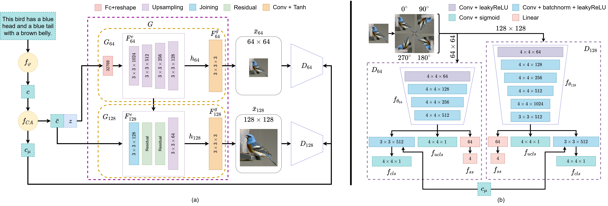
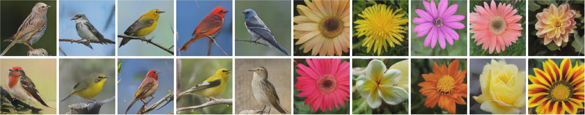

# Text-to-image synthesis with self-supervised bi-stage generative adversarial network

This repository provides the **pytorch** code for the paper "[Text-to-image synthesis with self-supervised bi-stage generative adversarial network](https://doi.org/10.1016/j.patrec.2023.03.023)" by Yong Xuan Tan, Chin Poo Lee, Mai Neo, Kian Ming Lim, Jit Yan Lim.



## Environment
The code is tested on Windows 10 with Anaconda3 and following packages:
- python 3.7.13
- pytorch 1.4.0
- torchvision 0.5

## Dataset
We follow the same procedure and structure as [SSTIS](https://github.com/Jityan/SSTIS).

Download the preprocessed char-CNN-RNN text embeddings for [flowers](https://www.dropbox.com/sh/g8rmz41xblaszb1/AABPNtIcLu1fKNoBsJTHJTIKa?dl=0) and [birds](https://www.dropbox.com/sh/v0vcgwue2nkwgrf/AACxoRYTAAacmPVfEvY-eDzia?dl=0) and the images for [flowers](http://www.robots.ox.ac.uk/~vgg/data/flowers/102/) and [birds](http://www.vision.caltech.edu/datasets/cub_200_2011/). Put them into `./data/oxford` and `./data/cub` folder.

## Experiments
To train on Oxford:<br/>
```
python main.py --dataset flowers --exp_num oxford_exp
```
To evaluate on Oxford:<br/>
```
python main.py --dataset flowers --exp_num oxford_exp --is_test true
```

## Pre-trained Models
Download the [pretrained models](https://drive.google.com/file/d/1aiL6CBnOx-ZlMCDgo3Pl8XXPN1_kRMlW/view?usp=drive_link). Extract it to the `saved_model` folder.

Examples generated by SSBi-GAN:


## Citation
If you find this repo useful for your research, please consider citing the paper:
```
@article{TAN202343,
  title = {Text-to-image synthesis with self-supervised bi-stage generative adversarial network},
  journal = {Pattern Recognition Letters},
  volume = {169},
  pages = {43-49},
  year = {2023},
  issn = {0167-8655},
  doi = {https://doi.org/10.1016/j.patrec.2023.03.023},
  url = {https://www.sciencedirect.com/science/article/pii/S0167865523000880},
  author = {Yong Xuan Tan and Chin Poo Lee and Mai Neo and Kian Ming Lim and Jit Yan Lim}
}
```

## Contacts
For any questions, please contact: <br/>

Yong Xuan Tan (yongxuan95@gmail.com) <br/>
Jit Yan Lim (jityan95@gmail.com)

## Acknowlegements
- [Text-to-Image Synthesis](https://github.com/aelnouby/Text-to-Image-Synthesis)
- [StackGAN](https://github.com/hanzhanggit/StackGAN)
- [StackGAN++](https://github.com/hanzhanggit/StackGAN-v2)
- [HDGAN](https://github.com/ypxie/HDGan)
- [SS-GAN](https://github.com/vandit15/Self-Supervised-Gans-Pytorch)

## License
This code is released under the MIT License (refer to the LICENSE file for details).
